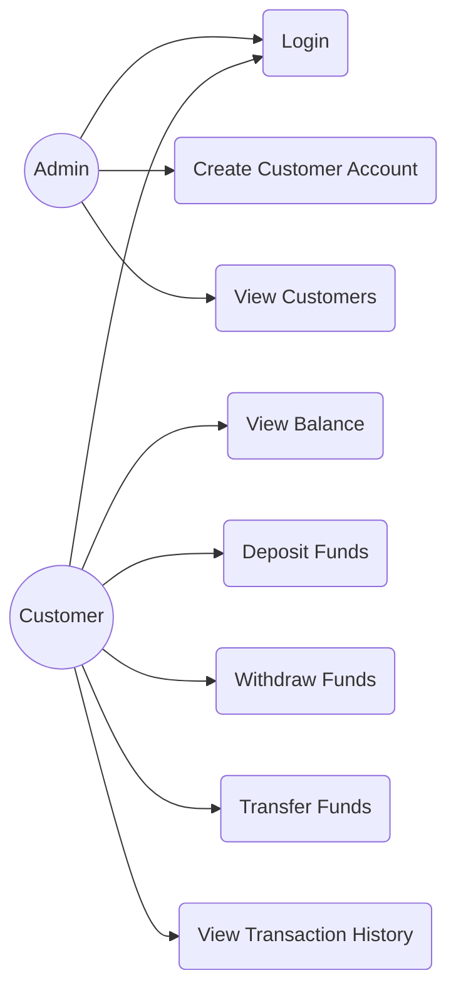
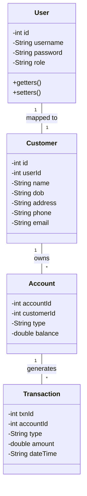
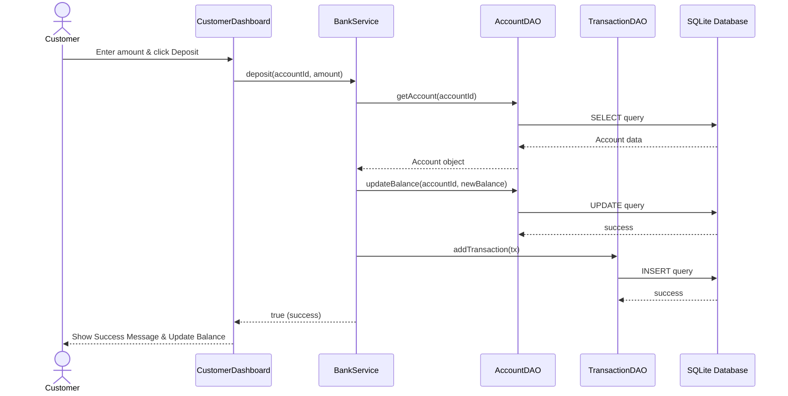

# Bank Management System Project Report

## 1. Overview
This is a robust and modular Bank Management System built using Core Java, Java Swing for the GUI, and SQLite for persistent storage. It follows the MVC architecture, utilizes the DAO pattern for database interactions, and features separate dashboards for Admins and Customers.

## 2. UML Diagrams

### Use Case Diagram


### Class Diagram


### Sequence Diagram: Deposit Funds


## 3. Database Schema
The database uses SQLite and is initialized automatically.
- **users**: `id` (PK), `username` (UNIQUE), `password`, `role`
- **customers**: `id` (PK), `user_id` (FK), `name`, `dob`, `address`, `phone`, `email`
- **accounts**: `account_id` (PK), `customer_id` (FK), `type`, `balance`
- **transactions**: `txn_id` (PK), `account_id` (FK), `type`, `amount`, `date_time`

## 4. Deployment Instructions

### Prerequisites
- Java Development Kit (JDK) 17 or higher
- Apache Maven (Optional, for building from command line)
- An IDE (IntelliJ IDEA, Eclipse, or VS Code)

### Building the Executable JAR
If you have Maven installed, open your terminal in the project directory (`Bank Management System`) and run:
```bash
mvn clean package
```
This downloads dependencies (SQLite JDBC, SLF4J, JUnit), compiles the code, runs tests, and packages an executable JAR file in the `target` folder.

### Running the Application
**Option A: Using the Executable JAR**
After packaging, run:
```bash
java -jar target/BankManagementSystem-1.0-SNAPSHOT.jar
```

**Option B: Using an IDE**
1. Import the `Bank Management System` folder as a Maven Project into your IDE.
2. Wait for dependencies to resolve.
3. Locate `src/main/java/com/bankmanagement/ui/MainApp.java` and run it.

### Testing
Unit tests for the service layer are included in `src/test/java/...`.
Run them using Maven:
```bash
mvn test
```

### Default Credentials
Upon the first run, the SQLite database (`bank.db`) is automatically created, and a default admin is inserted.
- **Username:** `admin`
- **Password:** `admin123`
